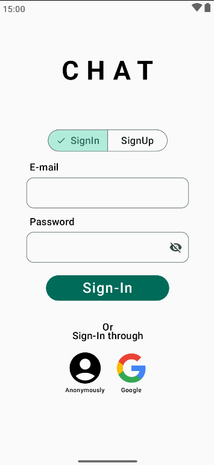

# 💬 Compose-Android-Chat

A modern, high-performance real-time messaging application built with **Jetpack Compose** and **Firebase**. This project demonstrates **Clean Architecture** principles, offline-first capabilities, and seamless social authentication.

---

## 📸 Preview

|                       Login Screen                        |                        Onboarding Screen                        |                         Chat List                         |                             Messaging UI                             |
|:---------------------------------------------------------:|:---------------------------------------------------------------:|:---------------------------------------------------------:|:--------------------------------------------------------------------:|
|  |  |  | **System Architecture Ready**   _(UI Implementation in Progress)_ |

---

## ✨ Features

* **Authentication:** * Secure Email/Password Sign-up & Login.
    * One-tap Google Sign-In integration.
* **User Discovery:** Search for friends and users globally via their display names.
* **Real-time Messaging:** * Instant message delivery powered by Firestore.
    * Typing indicators & Read receipts.
    * Edit and Delete message functionality.
* **Offline Support:** Fully functional offline mode using **Room SQLite** to cache conversations and profiles.
* **Image Support:** Profile picture uploads and media sharing via **Firebase Storage** and **Coil**.
* **Modern UI:** 100% Jetpack Compose with Material 3 design, supporting Dark Mode and fluid animations.

---

## 🛠 Tech Stack & Architecture

This project follows **Google's Recommended Architecture** guidelines for robust, maintainable apps.

* **Language:** [Kotlin](https://kotlinlang.org/) (Coroutines + Flow)
* **UI Framework:** [Jetpack Compose](https://developer.android.com/jetpack/compose) (Material 3)
* **Dependency Injection:** [Hilt](https://developer.android.com/training/dependency-injection/hilt-android)
* **Local Database:** [Room](https://developer.android.com/training/data-storage/room) (Offline-first source of truth)
* **Backend:** [Firebase](https://firebase.google.com/) (Auth, Firestore, Storage)
* **Image Loading:** [Coil](https://coil-kt.github.io/coil/)
* **Architecture:** MVVM (Model-View-ViewModel) + Clean Architecture (Data, Domain, UI layers)

---
